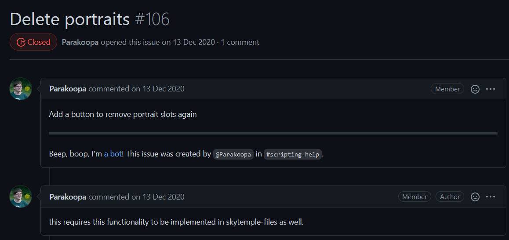

[SkyTemple](https://github.com/SkyTemple) est un outil open source de modification d'image disque (ou ROM) de Pokémon Donjon Mystère: Explorateurs du Ciel.

Ce projet est hébergé sur GitHub, développé en Python et dépend de l'outil de conception d'interface [Glade](https://glade.gnome.org/). Ayant un grand attachement au jeu en question et souhaitant apprendre à utiliser ces technologies, j'ai cherché à contribuer à ce projet.

Ce projet étant assez jeune, il y avait beaucoup de pistes d'améliorations.

Parmis la liste des issues listées sur le repository, j'ai choisi [celle-ci](https://github.com/SkyTemple/skytemple/issues/106) :

J'ai du passer par la compréhension de plusieurs parties essentielles du code pour ajouter cette fonctionnalité, notamment la fonction permettant d'écrire les nouvelles données sur la ROM, j'ai communiqué avec d'autres contributeurs du projet pour assimiler certains principes de l'application. J'ai aussi eu à modifier l'UI via Glade pour rajouter les boutons voulus et les lier au code.

La fonctionnalité terminée avait cette apparence, ma [pull-request](https://github.com/SkyTemple/skytemple/pull/214) a été acceptée après une modification graphique de la part des développeurs principaux du projet.

