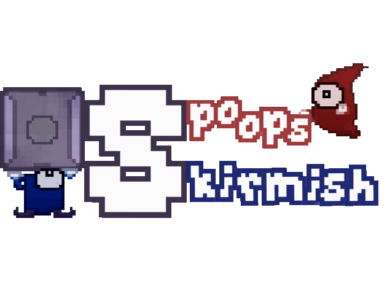
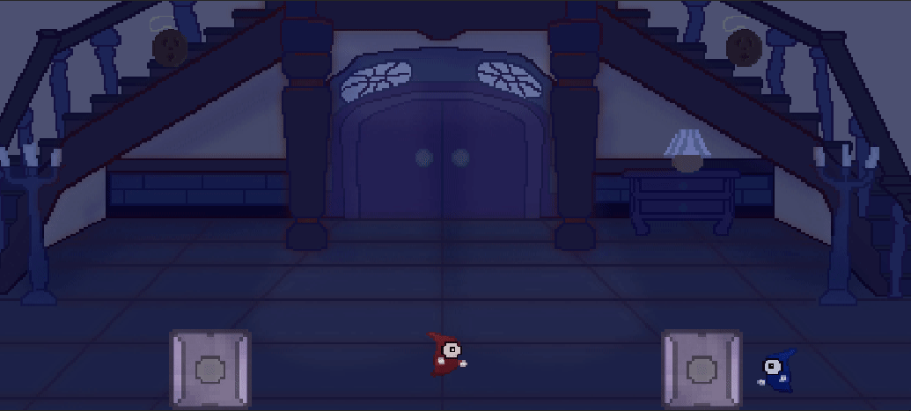
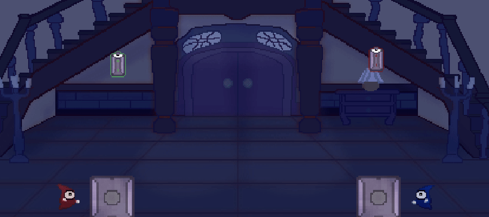
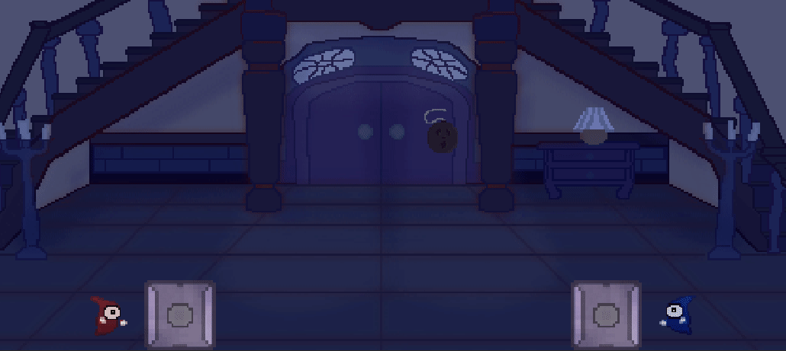

Spoops Skirmish est un jeu de combat jouable localement au clavier, il a été réalisé du 12 au 18 mars 2021 dans le cadre de la WeeklyGameJam #192 qui avait pour thème « Objet Hanté ». Il est jouable gratuitement sur [ma page itch.io](https://dracau.itch.io/spoops-skirmish)

Dans ce jeu, chaque joueur contrôle un fantôme rouge ou bleu (que l’on appelle un Spoop), chacun a un bloc à disposition qu’il peut soulever ou hanter. Lorsqu’un bloc est hanté, il peut lancer un faisceau de lumière qui tue le Spoop adverse, il est aussi possible de tuer un Spoop en l’écrasant avec un bloc.

Chaque bloc possède une certaine réserve de carburant, et celle-ci descend très vite. Il est possible de manipuler cette réserve en utilisant les objets apparaissant sur le terrain, soit en jetant l’objet sur le bloc, soit en jetant le bloc sur l’objet.

Les batteries vertes remplissent la réserve, les batteries rouges la vident.

Il existe aussi des bombes, qui produisent une explosion lorsqu’elles sont jetées sur un bloc, elles tuent un Spoop si celui-ci est à côté du bloc, ou si il hante le bloc touché.

Ce projet a été réalisé en C# sur Unity, il s’agit de ma 1ère Jam en équipe.

Je me suis occupé du Game Design ainsi que de la majorité du travail de programmation, j’ai eu l’aide de 2 amis: ADM et El Laggron, ADM gérait le design graphique ainsi que les SFX, El Laggron a programmé la mécanique du faisceau de lumière.

Les retours sur ce jeu, bien que moins nombreux que pour Tentacle Draft de par la période, sont restés très positifs malgré une prise en main assez difficile.