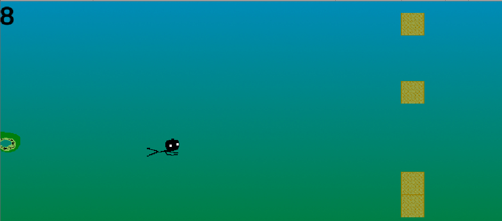
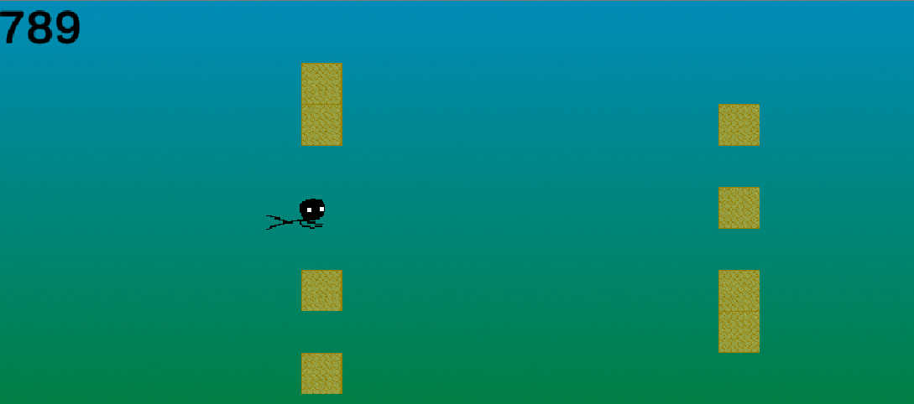

Tentacle Draft est un endless runner solo jouable au clavier, il a été réalisé du 1er au 7 janvier 2021 dans le cadre de la WeeklyGameJam #182 qui avait pour thème « Cthulu ». Il est jouable gratuitement sur [itch.io](https://dracau.itch.io/tentacle-draft)

Dans ce jeu, le joueur contrôle un stickman qu’il peux déplacer de bas en haut avec 2 boutons. Plus le joueur va loin, plus il gagne de points. Pour l’empêcher d’avancer, des blocs et des tentacules apparaissent à une fréquence et un emplacement aléatoire. Les blocs forcent le joueur à choisir un chemin pour passer, et les tentacules restreignent les mouvements du joueur. Lorsque le joueur touche un bloc ou un tentacule, il a perdu et obtient son score final.

Quand le joueur atteint certains seuils de points, la difficulté du jeu augmente, les blocs arrivent plus vite, les tentacules apparaissent plus fréquemment et en plus grand nombre. Un nouveau type de tentacule apparaît aussi, là où les tentacules verts classiques sont lents et servent à bloquer le joueur, les tentacules rouges arrivent très vite et obligent le joueur à prendre une décision rapidement.

J’ai réalisé ce jeu seul en C# sur Unity, il s’agit de mon premier projet de Jam et de mon premier jeu « complet ». Bien que ce jeu soit simple et que je n’aie pas pu inclure toutes mes idées, je suis fier d’avoir pu produire un prototype jouable dans le délai imparti, et cela uniquement sur mon temps libre.